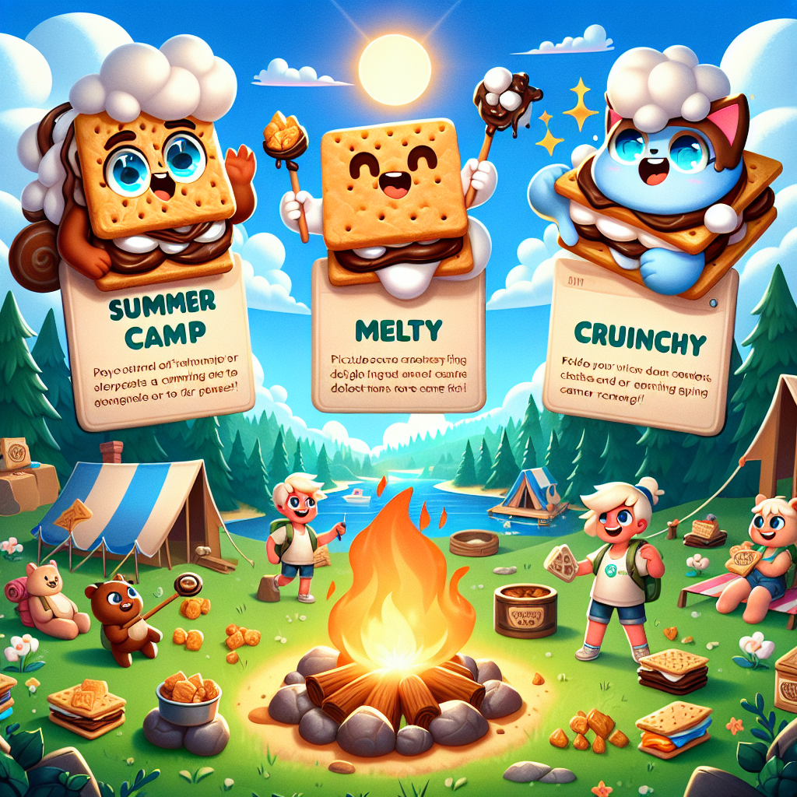

# Roast and Toast - Summer Camp Fun

## Introduction

Roast and Toast is a whimsical, summer camp-themed game centered around the beloved tradition of making s'mores. Designed to capture the essence of outdoor camping excursions, the game challenges players to build the most delicious and elaborate s'mores using an ever-expanding array of ingredients. With each level introducing a new component, the game keeps players engaged by progressively increasing the complexity of their s'more-creation tasks.

### Version

Roast and Toast is currently at version 1.1. This version introduces various updates and improvements to enhance gameplay, ensuring a smooth and delightful experience as players navigate through the different levels and encounter new ingredients.

### Theme

The game's theme resonates with anyone who has fond memories of summer camps, bonfires, and the gratifying task of roasting marshmallows to golden perfectionâ??or setting them on fire, if that's your style. The charming graphical style, complete with bright colors and playful character designs, offers a cozy, nostalgic feeling. The whimsical nature of the game perfectly complements its core activity, which is the joyful assembly of sâ??mores.

### Game Details

Each level in Roast and Toast brings a fresh ingredient into the mix, slowly building up the complexity and variety of options available for crafting the ultimate s'more. Whether itâ??s a classic graham cracker or an inventive new topping, these ingredients broaden the horizon for customization and creative expression within the game. This structured progression not only enhances the player's cooking arsenal but also continuously spices up the gameplay, keeping it refreshingly dynamic and engaging.

## Gameplay

In Roast and Toast, you start with the fundamental components of any classic s'more: a marshmallow, a piece of chocolate, and a graham cracker. As you progress through the levels, additional ingredients become available, allowing for more elaborate creations. Each new level not only adds a new ingredient but also ramps up the difficulty, requiring quicker reflexes and sharper decision-making skills. From perfect timing in roasting the marshmallow to stacking your s'more tower just right without it toppling over, the game integrates simple yet addictive mechanics that make each session uniquely fun.

## Characters

Roast and Toast features three main characters, each introduced gradually as you advance through the game. These characters are anthropomorphic representations of the primary ingredients used in crafting s'mores, which adds a layer of personality and charm to the game.

### Crispy

Crispy is the leader of the gang and the first character you meet in the game. He is a white and puffy marshmallow often depicted with a slightly charred edge, signifying his frequent brush with fire during roasting. Introduced at Level 1, Crispy forms the base ingredient in making s'mores and sets the tone for your adventure. His design emphasizes his soft and squishy nature, evoking both humor and nostalgia.

Crispyâ??s role is pivotal, and his burning enthusiasm is contagious. As the leader, he often guides players through the mechanics of the game, offering tips and tricks to master the art of s'more construction. His whimsical nature and humorous quips make him an endearing guide and companion throughout the journey.

### Melty

Melty is the tastiest chocolate bar one could ever find, introduced at Level 2. With his rich cocoa charm and velvety texture, Melty adds the critical middle layer to the s'more, making it irresistibly sweet. His design is sleek and enticing, showcasing the appeal of high-quality chocolate. 

Melty's inclusion marks the point where the game starts to increase in complexity. Players must now juggle between roasting their marshmallows perfectly and carefully melding them with melting chocolate. Meltyâ??s presence adds a sophisticated touch to the game, making each victory taste all the sweeter.

### Crunchy

Crunchy is the final member of the trio, representing the humble yet essential graham cracker. Introduced at Level 3, Crunchy hangs around the s'mores gang, providing the necessary structure and balance to the gooey treat. Unlike Crispy and Melty, Crunchy is notably missing, a subtle hint of mystery that tantalizes players and drives them to keep advancing through the game.

Crunchyâ??s crisp and textured design reflects his sturdy yet accommodating nature, vital in holding together the delightful mess of melted marshmallow and chocolate. As the levels progress and the challenges become more intricate, Crunchy's contribution becomes even more crucial, proving that sometimes the simplest elements are the most essential.

## Levels and Ingredients

Each level in Roast and Toast unfolds a new piece of the culinary puzzle. What starts with basic toasty marshmallows evolves into
